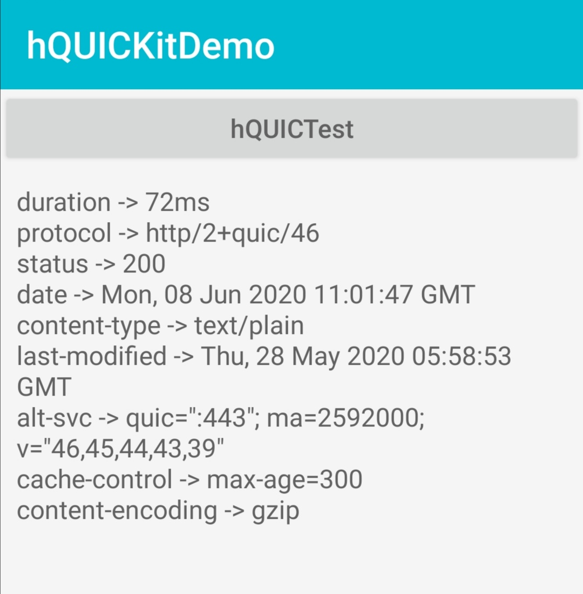

# HMS hQUIC Demo
English | [中文](https://github.com/HMS-Core/hms-hQUIC-demo/blob/master/README-zh.md)
## Table of Contents

 * [Introduction](#introduction)
 * [Getting Started](#getting-started)
 * [Supported Environments](#supported-environments)
 * [Result](#result)
 * [License](#license)

## Introduction
   With the hms-hQUIC-demo, you will experience how to interact with the backend server using the
   QUIC protocol through hQUIC Kit.

## Getting Started
   1. Check whether the Android studio development environment is ready.
   2. Open the demo project, and modify the URL in the HQUICActivity.java file. The URL must be the URL of the GET request and support the QUIC protocol.
   3. Run the demo on your Android device.

## Supported Environments
   Android SDK Version >= 19 and JDK version >= 1.7 is recommended.

## Result
   

## Question or issues
If you want to evaluate more about HMS Core, [r/HMSCore on Reddit](https://www.reddit.com/r/HuaweiDevelopers/) is for you to keep up with latest news about HMS Core, and to exchange insights with other developers.

If you have questions about how to use HMS samples, try the following options:
- [Stack Overflow](https://stackoverflow.com/questions/tagged/huawei-mobile-services) is the best place for any programming questions. Be sure to tag your question with 
`huawei-mobile-services`.
- [Huawei Developer Forum](https://forums.developer.huawei.com/forumPortal/en/home?fid=0101187876626530001) HMS Core Module is great for general questions, or seeking recommendations and opinions.

If you run into a bug in our samples, please submit an [issue](https://github.com/HMS-Core/hms-hQUIC-demo/issues) to the Repository. Even better you can submit a [Pull Request](https://github.com/HMS-Core/hms-hQUIC-demo/pulls) with a fix.

## License
   hms-hQUIC-demo is licensed under the [Apache License, version 2.0](http://www.apache.org/licenses/LICENSE-2.0).
